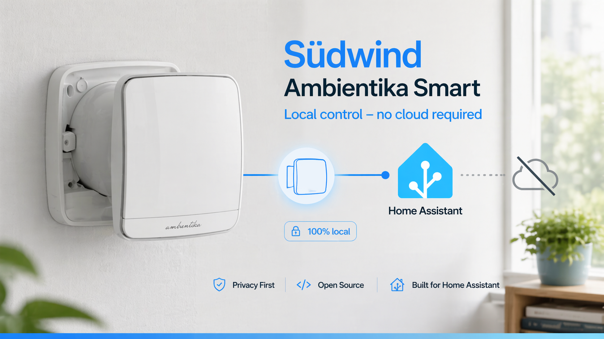

<p align="center">
  
</p>

# Ambientika Local — Native Home Assistant Integration

  

Cloud-free control for Südwind Ambientika ventilation units as a native Home Assistant custom integration. The fan connects directly to Home Assistant over its existing TCP protocol: **no MQTT broker, Docker add-on or vendor account is used at runtime**.

> [!WARNING]
> This is beta software tested with one Ambientika Smart configured as a standalone master (micro `0.0.11`, radio `0.0.21`). Other models and firmware may use different frames. Read [Compatibility and limitations](#compatibility-and-limitations) before installation.

## Which “Ambientika Local” is this?

This repository is an independent, native Home Assistant integration. It is not
the manufacturer’s [official Ambientika Local App](https://github.com/ambientika-eu/ambientika-local-app).

| | This repository: `ambientika-local-ha` | Official `ambientika-local-app` |
|---|---|---|
| Primary interface | Native Home Assistant entities | Separate browser app (PWA) |
| Local device path | Fan → Home Assistant over TCP | Fan → local bridge → MQTT → FastAPI/PWA |
| Additional runtime services | None | MQTT broker, bridge and web backend |
| Vendor cloud | Never used at runtime | Default Compose mode uses it; a separate cloudless mode is available |
| Installation | HACS or manual custom component | Docker Compose |

### Smaller and hardened by design

This integration deliberately avoids adding a broker, REST API, WebSocket or
separate web application to the trust boundary. Its TCP listener stays closed
until a known device is configured or a five-minute enrollment window is opened.
Unknown devices remain quarantined as candidates; telemetry admission and command
writes require separate approval. Write access is tied to an observed firmware
profile and is revoked automatically when that profile changes. Optional IP
binding, bounded parsing and rate limits, plus redacted logs and diagnostics,
further reduce the exposed surface.

These controls harden the local endpoint; they do not add authentication or
encryption to the vendor’s underlying TCP protocol. Keep it on a trusted,
firewalled network.

The GitHub repository [`Opcodeffm/ambientika-local-app`](https://github.com/Opcodeffm/ambientika-local-app)
is only a fork of the official project used to contribute fixes upstream. It is
not another distribution of this Home Assistant integration.

## Features

- Native Home Assistant entities with local push updates
- Local status and control without the Ambientika cloud
- No MQTT broker or additional service
- Explicit five-minute enrollment instead of permanent open discovery
- Separate approval for device admission and command writes
- Optional device-to-IP binding, bounded TCP parsing and redacted diagnostics
- Automatic handling of the observed 19-byte and 21-byte status formats

## Requirements

- Home Assistant `2024.6` or newer
- An Ambientika unit already provisioned on your Wi-Fi network
- A local DNS override for `app.ambientika.eu`
- Network access from the fan to the selected Home Assistant address on TCP `11000`

If Home Assistant runs in a container without host networking, publish TCP `11000` from the container first.

The official Ambientika app and this integration cannot control the fan in parallel. Once the DNS override is active, the fan connects to Home Assistant instead of the vendor cloud.

## Entities

Per connected device:

- **Climate** — HVAC mode (`off` / `fan_only`), fan speed (`low` / `medium` / `high`), preset modes (Smart, Auto, Heat Recovery, Night, Away, Surveillance, Timed Expulsion, Expulsion, Intake)
- **Sensors** — Temperature (°C), Humidity (%), Air Quality, Signal Strength (disabled by default)
- **Binary Sensors** — Filter status (problem), Humidity Alarm, Night Alarm
- **Button** — Filter Reset

## Installation

### HACS (custom repository)

1. Open **HACS → Integrations → ⋮ → Custom repositories**.
2. Add `https://github.com/Opcodeffm/ambientika-local-ha` as an **Integration**.
3. Install **Ambientika Local** and restart Home Assistant.

### Manual

1. Copy `custom_components/ambientika_local/` to `<config>/custom_components/ambientika_local/`.
2. Restart Home Assistant.

Do not add the integration until you are ready to complete the enrollment steps below; the initial enrollment window lasts five minutes.

## First setup

The fan normally opens an outgoing connection to `app.ambientika.eu:11000`. A local DNS record must resolve that hostname to the Home Assistant address selected for this integration.

1. In Home Assistant, open **Settings → Devices & Services → Add Integration**, select **Ambientika Local**, and enable **Open a five-minute enrollment window**.
2. Create the local DNS record `app.ambientika.eu → <Home Assistant IP>` in UniFi, Pi-hole, AdGuard Home or another DNS server used by the fan.
3. Confirm from the fan network that `app.ambientika.eu` resolves to the intended Home Assistant address.
4. Safely disconnect the ventilation unit from power for about 20 seconds, then restore power. A Wi-Fi restart alone may leave the existing cloud connection open.
5. Open **Settings → Devices & Services → Ambientika Local → Configure**. Approve only the expected candidate after checking its redacted identifier suffix, source subnet and firmware.
6. Keep the proposed IP binding if the fan has a stable DHCP reservation. Enable command writes only for the expected firmware profile; otherwise the device remains read-only.

If you already know the unit's 12-character device identifier, you can enter it during initial setup instead of using enrollment. Command writes still require a locally observed firmware profile and separate approval.

## Enrollment and command approval

The listener remains closed until an owned device ID is configured or enrollment is explicitly opened. Unknown devices seen during enrollment are recorded as candidates but do not create entities. An approved device provides telemetry; command writes require a second approval tied to its observed firmware profile. A firmware change automatically returns that device to read-only operation.

Useful advanced options:

- Bind the listener to the Home Assistant address on the fan network instead of `0.0.0.0` where possible.
- Keep the listener on TCP `11000` unless the device endpoint or network routing deliberately uses another port.
- Keep status frame length on `auto` unless an observed device requires `19` or `21` explicitly.
- Leave legacy TCP `4521` disabled unless traffic from an owned device proves it is required.
- Keep firmware identification required. Disabling it may permit telemetry from older firmware, but command writes still require a firmware handshake.

These controls reduce accidental or unauthorised LAN access, but they do not add cryptography to the vendor protocol. Keep the listener behind a firewall and never expose TCP `11000` or `4521` to the internet.

## Existing installations

Upgrading from an earlier beta imports device identifiers already associated with the integration. Command writes are disabled during migration until each observed firmware profile is approved. If no identifier can be recovered, the listener stays closed and Home Assistant Repairs explains how to reopen enrollment.

## Recommended network policy

- Fans may reach Home Assistant on TCP `11000`.
- Fans may reach local DNS and, if required, local NTP.
- Fans have no direct WAN access.
- Other IoT and guest clients cannot reach TCP `11000`.
- TCP `4521` remains closed unless an owned-device capture proves it is required.

Do not rely on blocking one historical vendor IP address; it can change. Use the DNS override together with an outbound firewall policy.

## Diagnostics and Repairs

Use the integration menu in **Settings → Devices & Services** to download diagnostics. The report includes policy state, aggregate counters, redacted identifier suffixes, shortened IP networks and firmware profiles. It excludes complete device identifiers, exact peer IPs, raw frames, credentials and cloud data.

Home Assistant Repairs reports a closed listener when no device is approved and warns when the listener is bound to every network interface.

## Troubleshooting

### No candidate appears

- Confirm that the fan uses the DNS server containing the override.
- Confirm that the selected Home Assistant address is reachable from the fan network on TCP `11000`.
- Reopen the five-minute enrollment window if it expired.
- Power-cycle the unit after the listener and DNS override are ready.

### Fan does not reconnect after a DNS change

The Wi-Fi module may keep its existing cloud TCP connection open. Safely remove power from the complete ventilation unit for about 20 seconds, then restore it.

### Status frame is not recognised

Keep the frame length on `auto` for known 19-byte and 21-byte devices. A different length requires a parser update; do not force a wrong size. [Open an issue](https://github.com/Opcodeffm/ambientika-local-ha/issues) with the model, firmware versions and frame length, but without a raw packet capture or complete device identifier.

### Debug logging

Add this to `configuration.yaml`:

```yaml
logger:
  default: warning
  logs:
    custom_components.ambientika_local: debug
```

Then restart HA and look under **Settings → System → Logs** for `ambientika_local`.

## Compatibility and limitations

- Tested with one Ambientika **Smart** configured as a standalone master: micro `0.0.11`, radio `0.0.21`.
- Supported status lengths are `19` and `21` bytes. A 22-byte format reported for newer firmware is not yet supported.
- Master/slave zone coordination over UDP is not implemented.
- Smart-mode outdoor weather updates are not sourced from a Home Assistant weather entity.
- BLE/Wi-Fi provisioning is not implemented; provision the unit before switching it to local control.
- Parallel operation with the Ambientika cloud and official app is not supported.

## Protocol

The binary TCP protocol used by the fans is documented in [sragas/ambientika-local-control/ambientika-protocol.md](https://github.com/sragas/ambientika-local-control/blob/master/ambientika-protocol.md). Highlights:

- Fan opens an outgoing TCP connection to `app.ambientika.eu:11000`
- Sends 18-byte firmware-info message on connect
- Sends 19 or 21-byte status messages every ~30 seconds
- Accepts 13-byte operating mode commands and 9-byte filter reset commands
- No authentication, no encryption — raw bytes on a socket

## Security and privacy

- Debug logs redact the embedded MAC/device identifier and shorten peer IP addresses.
- Unknown devices never create entities, and devices are read-only until an observed firmware profile is separately approved for command writes.
- Do not publish raw packet captures, exact device IPs or complete device identifiers.
- Keep TCP 11000 private to the fan network; never forward it from the internet.
- See [SECURITY.md](SECURITY.md) for the private-reporting and evidence-handling policy.

## License

MIT — see [LICENSE](LICENSE).

## Acknowledgements

- [sragas/ambientika-local-control](https://github.com/sragas/ambientika-local-control) — original protocol reverse engineering
- [alexlenk/ambientika-local-control-ha-addon](https://github.com/alexlenk/ambientika-local-control-ha-addon) — actively maintained MQTT-based Home Assistant add-on and additional firmware compatibility work

## Disclaimer

This is an unofficial, community-developed integration. It is **not affiliated with, endorsed by, or sponsored by Südwind s.r.l.** "Südwind" and "Ambientika" are trademarks of their respective owners and are used here only to describe compatibility.
